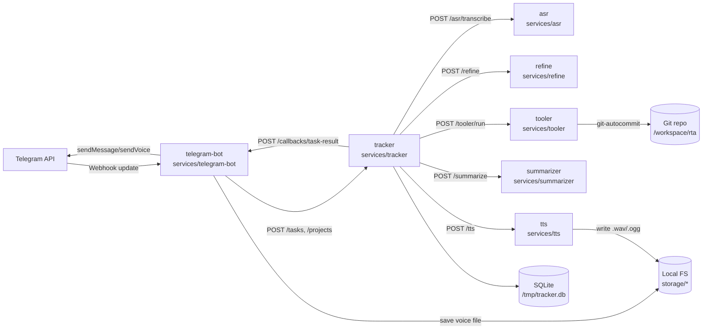
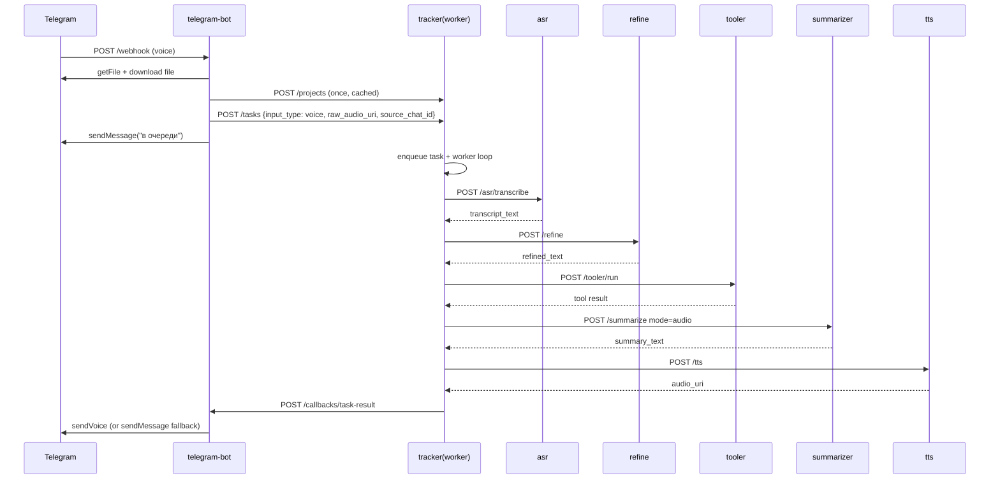
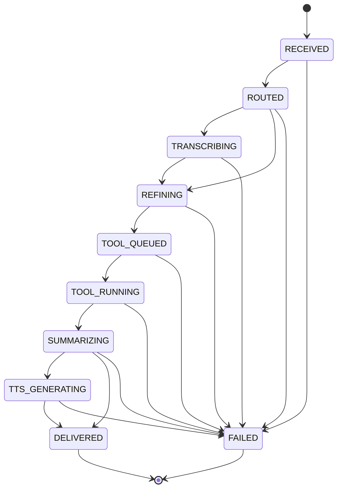
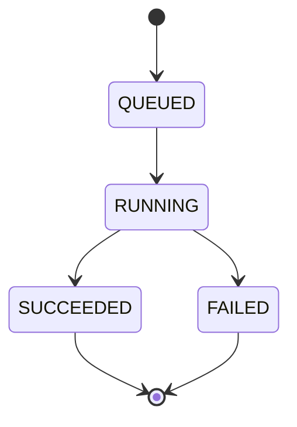

# RTA Monorepo Skeleton

RTA — это dev-ориентированный монорепозиторий с набором микросервисов для обработки входящих задач из Telegram. Основной сценарий: получить текст/голос, прогнать через пайплайн обработки (ASR → refine → tool → summarize → TTS при необходимости) и вернуть результат пользователю через callback в Telegram-бот.  
Оркестрация сейчас реализована внутри `tracker`: при создании задачи она ставится во внутреннюю очередь, а фоновой worker последовательно вызывает остальные сервисы по HTTP.

## Архитектура

### Что это за система

Система состоит из 7 сервисов в `services/` и JSON-контрактов в `packages/contracts`.  
`telegram-bot` принимает webhook-обновления, создает `project/task` в `tracker`, а затем получает callback о завершении и отправляет ответ пользователю. `tracker` хранит состояние в SQLite, ведет историю статусов и выполняет синхронную оркестрацию пайплайна через `asr`, `refine`, `tooler`, `summarizer`, `tts`.

### Контекст и компоненты



### Как работает пайплайн

#### Сценарий text
1. `telegram-bot` получает `/webhook` с текстом, создает/кэширует проект через `POST /projects`, затем создает задачу `POST /tasks` с `input_type=text`.
2. `tracker` создает задачу со статусом `RECEIVED`, кладет `task_id` во внутреннюю очередь (`queue.Queue`) и worker начинает обработку.
3. `tracker` переводит задачу в `ROUTED` → `REFINING`, вызывает `refine /refine`.
4. Затем `tracker` делает `TOOL_QUEUED` → `TOOL_RUNNING`, создает запись `tool_runs` и вызывает `tooler /tooler/run`.
5. После выполнения инструмента `tracker` переходит в `SUMMARIZING`, вызывает `summarizer /summarize`.
6. Для text-задачи после summary сразу `DELIVERED`, затем `tracker` отправляет callback в `telegram-bot /callbacks/task-result`, бот отправляет `sendMessage` в Telegram.

#### Сценарий voice (end-to-end)


### Поток данных и статусы

#### State machine: Task


#### State machine: ToolRun


### Runtime / deployment (docker-compose)

```mermaid
flowchart TB
    subgraph dc[docker-compose]
      BOT[telegram-bot:8000\n(host 8001)]
      TR[tracker:8000\n(host 8002)]
      TL[tooler:8000\n(host 8003)]
      ASR[asr:8000\n(host 8004)]
      RF[refine:8000\n(host 8005)]
      SM[summarizer:8000\n(host 8006)]
      TTS[tts:8000\n(host 8007)]
    end

    BOT --> TR
    TR --> ASR
    TR --> RF
    TR --> TL
    TR --> SM
    TR --> TTS
```

## Компоненты

| Сервис | Назначение | Порт (host→container) | Ключевые endpoint'ы |
|---|---|---|---|
| `telegram-bot` | Принимает Telegram webhook, создает задачи в tracker, отправляет результаты обратно в Telegram | `8001→8000` | `POST /webhook`, `POST /callbacks/task-result`, `GET /health` |
| `tracker` | Оркестратор пайплайна + SQLite-хранилище проектов/задач/tool-runs + status history | `8002→8000` | `POST /projects`, `GET /projects`, `POST /tasks`, `GET/PATCH /tasks/<id>`, `POST /tool-runs`, `GET /tool-runs/<id>`, `GET /health` |
| `tooler` | Запуск инструментов (`dummy`, `codex`, `git-autocommit`), sync и async API | `8003→8000` | `POST /tooler/run`, `POST /tool-runs`, `GET /tool-runs/<id>`, `GET /health` |
| `asr` | Транскрибация аудио (`audio_uri`) в текст | `8004→8000` | `POST /asr/transcribe`, `GET /health` |
| `refine` | Нормализация/очистка текста и инференс project slug (mock/gemini) | `8005→8000` | `POST /refine`, `GET /health` |
| `summarizer` | Суммаризация результата tool-run (mock/LLM fallback) | `8006→8000` | `POST /summarize`, `GET /health` |
| `tts` | Генерация голосового ответа по тексту (`mock`/`silero`) | `8007→8000` | `POST /tts`, `POST /tts/synthesize`, `GET /health` |

## Хранилища и артефакты

- `tracker` использует SQLite (`DATABASE_URL`, в compose: `sqlite:////tmp/tracker.db`) с таблицами: `projects`, `tasks`, `task_status_history`, `tool_runs`.
- `telegram-bot` сохраняет скачанные voice-файлы в `STORAGE_DIR` (в compose: `/app/storage/telegram`, смонтировано из `./storage`).
- `tts` пишет `.wav/.ogg` в `storage/tts` (или `TTS_OUTPUT_DIR`).
- `tooler` (async mode) пишет логи и артефакты в `TOOLER_ARTIFACTS_DIR`.

## Git workflow (реализованный в tooler)

Для `tool_name=git-autocommit` сервис `tooler`:
- проверяет наличие `.git` в `input.workdir`,
- делает `git checkout -B autobot/YYYY-MM-DD`,
- выполняет `git add -A` и `git commit -m <subject>` (если есть staged changes),
- опционально делает `git push` при `GIT_PUSH=true`.

`tracker` может использовать этот режим синхронно через `SYNC_TOOL_NAME=git-autocommit` и прокидывает `workdir/subject` в `POST /tooler/run`.

## Запуск локально

```bash
docker compose up --build -d
```

Проверка health:

- `http://localhost:8001/health` → telegram-bot
- `http://localhost:8002/health` → tracker
- `http://localhost:8003/health` → tooler
- `http://localhost:8004/health` → asr
- `http://localhost:8005/health` → refine
- `http://localhost:8006/health` → summarizer
- `http://localhost:8007/health` → tts

Ожидаемый ответ:

```json
{
  "status": "ok",
  "service": "tracker"
}
```

## Ограничения / что пока не реализовано

- В `tracker` оркестрация сейчас синхронная и однопоточная по внутренней очереди процесса (in-memory queue), без внешнего брокера сообщений.
- Отдельный внешний worker/process manager (Celery/RQ/Kafka/NATS) в репозитории пока не реализован.
- Полноценная наблюдаемость (метрики/tracing) и формализованный OpenAPI на уровне всех сервисов пока не реализованы; в `packages/contracts` лежат схемы сущностей.

## Полезные директории

- `services/telegram-bot/` — прием webhook и отправка ответа в Telegram.
- `services/tracker/` — доменная модель задач и оркестрация пайплайна.
- `services/tracker/sql/schema.sql` — схема SQLite.
- `services/tooler/` — запуск инструментов, включая `git-autocommit`.
- `services/asr/`, `services/refine/`, `services/summarizer/`, `services/tts/` — этапы обработки.
- `packages/contracts/` — контракты и схемы.
